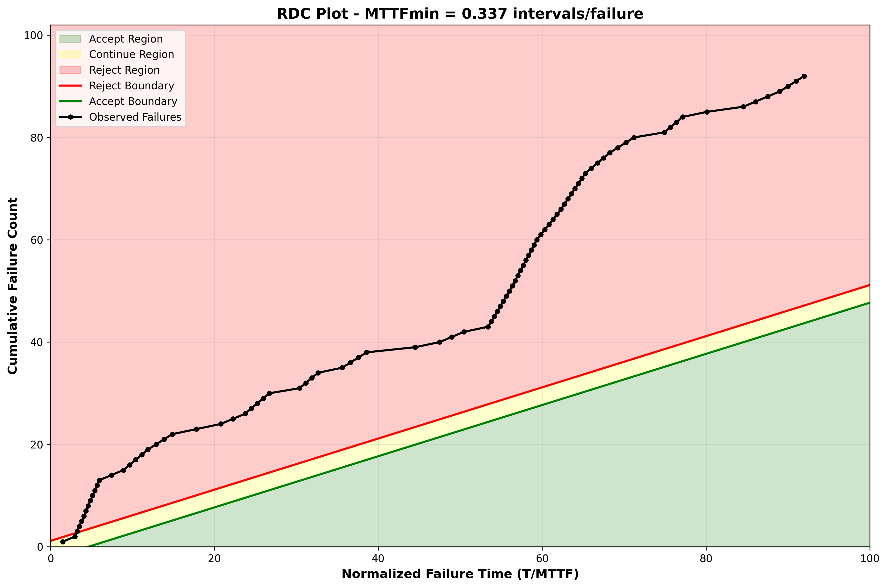
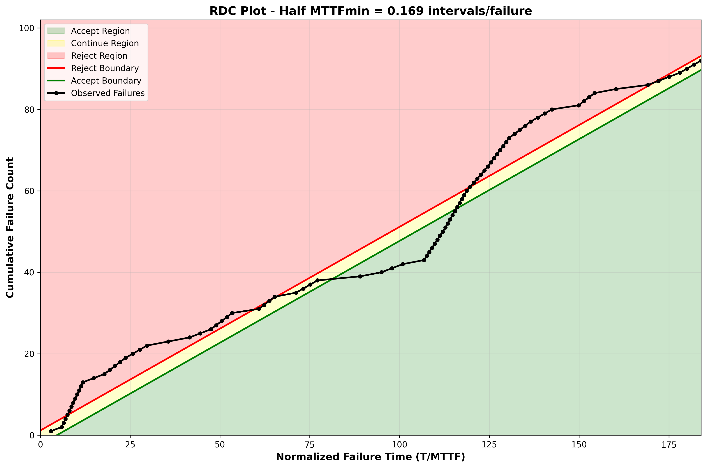
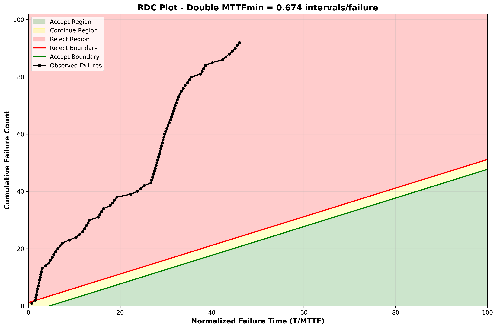

# SENG 637- Dependability and Reliability of Software Systems

## Lab. Report #5 – Software Reliability Assessment

| Group: 9 |
| -------- |
| Maheen   |
| Dipu     |
| Jasdeep  |
| Dhruvi   |

# Introduction

This report presents a comprehensive reliability assessment of a software system using two complementary methodologies: Reliability Growth Testing (RGT) and Reliability Demonstration Chart (RDC). The analysis is based on failure data collected over 31 testing intervals, encompassing 92 total failures. Part 1 employs reliability growth models to identify trends and predict future behavior, while Part 2 uses threshold-based RDC analysis to evaluate whether the system meets specific reliability requirements. The combination of both methods provides a multi-faceted view of system reliability, balancing predictive modeling with acceptance testing frameworks.

# Assessment Using Reliability Growth Testing

## Result of range analysis

### 1. Trend Analysis using the Laplace Factor

The Laplace Factor (u) is a statistical test used to determine if a software system is showing reliability growth. It evaluates the distribution of failures over a testing period [0, T].

- Negative Score (u < 0): Indicates Reliability Growth (the rate of failures is decreasing).
- Positive Score (u > 0): Indicates Reliability Decay (the rate of failures is increasing).
- Score below -2: Provides strong statistical evidence (at the 95% confidence level) that the system is significantly improving.

### 2. Laplace Factor Calculations

Based on the provided formula for failure count data, the Laplace factor is calculated as follows:

$$
u = \frac{\sum_{i=1}^{k} (i-1) \cdot n(i) - \frac{k-1}{2} \cdot \sum_{i=1}^{k} n}{\sqrt{\frac{k^2-1}{12} \cdot \sum_{i=1}^{k} n}}
$$

Where:

- $u$ = Laplace factor
- $k$ = number of intervals
- $\sum_{i=1}^{k} n$ = total number of failures
- $n(i)$ = number of failures in interval $i$
- $\sum_{i=1}^{k} (i-1) \cdot n(i)$ = weighted sum of failures

#### A. Full Dataset (Intervals 1–31)

- Number of intervals (k): 31
- Total failures (n): 92
- Weighted sum of failures Σ (i-1)n(i): 1330

Calculation:

- $u = \frac{1330 - \frac{(31-1)}{2} \times 92}{\sqrt{\frac{(31^2-1)}{12} \times 92}}$
- $u = \frac{1330 - 1380}{\sqrt{80 \times 92}}$
- $u = \frac{-50}{85.79}$
- u ≈ -0.58

Result: The score of -0.58 indicates a very weak growth trend that is not statistically significant. This suggests the full dataset contains too much inconsistency to be used for final modelling.

#### B. Selected Range (Intervals 19–31)

- Number of intervals (k): 13
- Total failures (n): 49
- Weighted sum of failures: $\sum_{i=1}^{k} (i-1) \cdot n(i) = 187$

Calculation:

- $u = \frac{187 - \frac{(13-1)}{2} \times 49}{\sqrt{\frac{(13^2-1)}{12} \times 49}}$
- $u = \frac{187 - 294}{\sqrt{14 \times 49}}$
- $u = \frac{-107}{26.19}$
- u ≈ -4.09

Result: The score of -4.09 is well below -2, providing strong statistical proof of significant reliability growth within this specific range.

### 3. Laplace Plots

#### A. Full Dataset (Intervals 1–31)

#### B. Segmented at interval 19

While the cumulative Laplace plot for the full dataset (1–31) shows a period of reliability decay between intervals 19 and 24, this period corresponds to a significant increase in execution effort (E) and identification work (F). This represents a 'Reliability Shock' where increased testing intensity uncovered a new cluster of failures.

To provide a meaningful reliability growth estimate, the data was segmented starting at Interval 19. Analysis of this segment shows that after the initial shock, the system entered a state of strong reliability growth (u ≈ -4.09). Modelling this specific range allows for a more accurate prediction of the software's stability under the current high-intensity testing regime.

### 4. Data Pre-processing and Reasoning

Based on the Laplace results, the data was pre-processed to focus exclusively on the Interval 19–31 range for the final analysis in C-SFRAT.

Reliability models in C-SFRAT perform best when the data follows a consistent trend. By removing the early "noise" and focusing on the period after the spike, we provide the tool with a clear, statistically verified growth trend (u = -4.09).

## Result of model comparison

A "Model Comparison" was done in C-SFRAT and, as suggested by [1], all models were used with all combinations of covariates. Results are given in model_results_19-31.csv, sorted by "Critic (Mean)" score. The "Critic (Mean)" score was used to identify the following top 2 models:

- GM with covariates E, F
- GM with covariates E, F, C

## Plots for failure rate and reliability of the SUT for the test data provided

### Failure Intensity plot

### MVF plot

## A discussion on decision making given a target failure rate

### Failure Intensity plot (prediction to 1.8)

The failure intensity profile provides a direct characterization of the system's reliability evolution over time. In the early testing phase, the system exhibits elevated failure intensity, reflecting a high defect density typical of immature system states. As testing progresses, a pronounced decline in failure intensity is observed, followed by convergence toward a stabilized regime in the later intervals (approximately 26-31). This transition from high to low failure intensity indicates effective fault detection, isolation, and correction processes, and constitutes clear empirical evidence of reliability growth.

### MVF plot (prediction to 5 intervals)

Complementing this, the Mean Value Function (MVF) captures the cumulative failure discovery process. During the observed interval, the MVF increases steadily, confirming that failures continue to be uncovered and that the system has not yet reached full defect saturation. However, in the predictive region beyond the observed data, the MVF exhibits a measurable reduction in slope, indicating a deceleration in failure accumulation. This behaviour suggests diminishing marginal returns in defect discovery, consistent with a system approaching asymptotic reliability. The close agreement between the selected models (GM with covariates E, F and GM with E, F, C) further enhances confidence in the robustness and generalizability of the predicted reliability trajectory.

In the absence of a predefined quantitative reliability requirement, a practical target failure intensity can be defined based on the stabilized regime of the observed data. From the failure intensity curve, this regime corresponds to approximately 1.5–2 failures per interval, representing an empirically derived operational threshold for acceptable system performance.

The observed failure intensity in the terminal intervals remains within or near this target band, indicating that the system satisfies the defined reliability criterion. Importantly, this conclusion is reinforced by the predictive MVF behaviour, which demonstrates a continued reduction in the rate of failure discovery, suggesting that the system is transitioning toward a stable operating state.

Taken together, the convergence of decreasing failure intensity, stabilization within the target range, and consistent model-based predictions provides strong evidence that the system has achieved substantial reliability growth. Accordingly, the system can be considered suitable for continued deployment or operational use within the context of the selected testing regime. However, the absence of complete MVF saturation indicates that residual defects may still exist, and further testing may yield incremental reliability improvements.

## A discussion on the advantages and disadvantages of reliability growth analysis

Reliability growth analysis (RGA) provides a principled statistical framework for quantifying the evolution of system reliability during testing. By explicitly modelling the failure process over time, it enables both inference on defect dynamics and prediction of future reliability states, making it a central tool in software reliability engineering.

### Advantages

A primary strength of RGA lies in its ability to capture temporal reliability evolution. Unlike static metrics, failure intensity functions and mean value functions provide a continuous representation of how defect discovery and correction impact system behaviour. This enables a mechanistic understanding of reliability improvement, rather than a purely descriptive assessment.

RGA also offers predictive capability through parametric modelling. Established formulations (e.g., NHPP-based models, Goel–Okumoto family, covariate-augmented models) allow extrapolation beyond observed data, supporting forward-looking decisions such as release readiness, residual defect estimation, and testing horizon planning. The inclusion of covariates further enhances model expressiveness by linking reliability to operational factors (e.g., execution effort, debugging intensity), enabling context-aware reliability assessment.

Another advantage is the statistical rigour underlying model selection and evaluation. Criteria such as AIC, BIC, and likelihood-based measures provide objective mechanisms for selecting models that balance explanatory power and parsimony. This facilitates reproducible and defensible decision-making grounded in quantitative evidence.

Finally, RGA supports data-driven optimization of testing strategies. By revealing phases of rapid defect discovery versus diminishing returns, it enables more efficient allocation of testing resources and informs decisions on when additional testing yields marginal benefit.

### Limitations

Despite its analytical strengths, RGA is inherently sensitive to data quality and segmentation. Early-phase testing data often exhibit non-stationary or noisy behaviour, and inclusion of such data without proper validation (e.g., via Laplace trend analysis) can bias parameter estimation and degrade predictive accuracy.

RGA is also model-dependent, and its conclusions are contingent on the appropriateness of the selected reliability model. Different model structures can yield divergent estimates of failure intensity and residual defect counts, introducing epistemic uncertainty. This is particularly pronounced when the underlying failure process deviates from model assumptions (e.g., non-Poisson behaviour, abrupt changes in testing intensity).

According to the lecture slides, reliability models should only be used on data where the overall reliability is increasing as testing continues. A further limitation is the implicit assumption of homogeneity in the failure process. In practice, software systems often undergo evolving operational profiles, varying test coverage, and heterogeneous defect classes, which can violate model assumptions and limit generalizability.

Additionally, RGA typically requires sufficient failure data to achieve statistical stability. In low-failure regimes or early testing stages, parameter estimates may be unstable, reducing confidence in both inference and prediction.

Finally, while RGA is effective for modelling test-phase behaviour, it does not inherently guarantee operational reliability equivalence, as real-world usage conditions may differ from controlled testing environments. Consequently, predictions must be interpreted within the context of the testing regime.

### Synthesis

Reliability growth analysis is most powerful when applied to statistically validated, sufficiently rich datasets, where it can yield both robust inference and actionable predictions. However, its effectiveness depends critically on appropriate model selection, careful data segmentation, and disciplined interpretation, particularly when extending conclusions beyond the observed testing domain.

---

# Assessment Using Reliability Demonstration Chart

## Overview

The Reliability Demonstration Chart (RDC) provides a graphical method to determine whether a system under test (SUT) meets its target Mean Time To Failure (MTTF) based on observed failure data. Unlike reliability growth testing, which focuses on modeling trends and predicting future behavior, RDC is a threshold-based decision tool that classifies system reliability into three regions: Accept, Continue Testing, or Reject.

## Data Preparation and Transformation

The original failure data was provided in grouped interval format (failures per time interval). To make this compatible with RDC analysis, which requires time-between-failure data, we transformed the dataset through the following process:

### Transformation Methodology

1. **Uniform Distribution Assumption**: For each interval with multiple failures, we assumed failures were uniformly distributed within that interval.

2. **Time-Between-Failures Calculation**: For interval *i* with *n* failures:
   - Time between failures (TBF) = 1 / *n*
   - Each failure in that interval is assigned TBF = 1 / *n*

3. **Cumulative Calculations**:
   - Cumulative failure count increments by 1 for each failure
   - Cumulative time increments by TBF for each failure

4. **Zero-Failure Intervals**: Intervals with 0 failures (intervals 10, 14, 25, 28) contribute to cumulative time but add no failure events.

Example: Interval 2 had 11 failures in 1 time unit

- TBF = 1/11 ≈ 0.091
- This creates 11 individual failure events, each with TBF = 0.091
- Total time contribution: $11 \times 0.091 = 1.0$

### Transformation Results

The transformation yielded:

- 92 individual failure events (expanded from 31 intervals)
- **Total cumulative time**: 31.0 time units
- **Observed MTTF**: 31 / 92 = **0.337 intervals/failure**

### Limitations of Transformation

This transformation introduces several assumptions that should be considered when interpreting results:

- Uniform distribution of failures within intervals may not reflect actual failure clustering
- Discrete approximation of a continuous failure process
- Information loss from aggregated data

These limitations became evident in the RDC results, where the transformation assumptions significantly affected trajectory behavior and decision outcomes.

## Risk Profile Selection

For this analysis, we used Risk Profile I with the following parameters:

- **Discrimination Ratio (γ)**: 2.0
- **Developer's Risk (α)**: 0.10 (10% chance of rejecting an acceptable system)
- **User's Risk (β)**: 0.10 (10% chance of accepting an unacceptable system)

These parameters define the boundaries between Accept, Continue Testing, and Reject regions on the RDC chart.

Methodological Note: The RDC boundary formulas used by our analysis tool create distinct Accept and Reject boundaries (with a visible Continue Testing region between them). The specific boundary calculations are tool-dependent and appear to implement more stringent criteria than simple average MTTF achievement.

## Determination of MTTFmin

### Methodological Limitation: Exploratory Framework

A fundamental limitation of our analysis is that we selected MTTFmin = 0.337 intervals/failure based on the observed system performance (31 intervals / 92 failures). This represents an exploratory rather than confirmatory approach.

In the absence of predetermined reliability requirements, stakeholder-defined MTTF targets, industry-specific standards, or operational performance specifications, we adopted an exploratory sensitivity analysis to understand:

1. How the system performs relative to its own baseline (0.337)
2. Whether reliability is robust or marginal when requirements vary
3. What safety margin exists above minimum demonstrated performance

### Interpretation Framework

For this analysis, the three MTTF scenarios should be interpreted as:

- **Half MTTFmin (0.169)**: "What if requirements allowed twice the observed failure rate?"
- **MTTFmin (0.337)**: "Does the system meet its own observed average performance?"
- **Double MTTFmin (0.674)**: "What if requirements were twice as stringent as observed performance?"

## RDC Analysis: Three MTTF Scenarios

### Scenario 1: Baseline Performance (MTTFmin = 0.337 intervals/failure)

Normalized Time Scale: Final point at 31 / 0.337 ≈ 92

**Trajectory Analysis:**

The observed failure trajectory for the baseline MTTF shows concerning behavior throughout the entire testing period:

Complete Rejection (Failures 1-92, Normalized Time 0-92):

- The trajectory remains entirely in the Reject region (red area) throughout all testing
- The failure line never crosses into the Accept region (green area) or Continue Testing region (yellow area)
- The trajectory stays consistently within the Reject boundary (red line)
- At no point during testing does the system demonstrate acceptable reliability at this MTTF threshold

Final Decision: **REJECT – The system fails to meet** even its own observed baseline MTTF of 0.337 intervals/failure.

**Critical Interpretation:**

This counterintuitive result—where the system fails to meet a threshold equal to its own average performance—reveals several important insights:

1. **RDC Boundary Stringency**: The RDC boundaries used by the analysis tool require more than simply achieving the average MTTF. The system must demonstrate consistently low failure rates throughout testing to enter acceptable regions.

2. **Cumulative Historical Impact**: RDC evaluates cumulative performance across all testing. The high failure intensity in early intervals (1-18) creates a trajectory deficit that persists despite later improvement.

3. **Transformation Effects**: The uniform distribution assumption used in transforming grouped interval data to time-between-failures may introduce systematic biases affecting the trajectory.

4. **Early Period Dominance**: Unlike Part 1 (RGT), which can segment data to focus on improving periods, RDC carries the burden of all historical failures, including the poor early testing phase.

**Comparison with Part 1 (Reliability Growth Testing):**

The complete rejection in RDC stands in stark contrast to Part 1's findings of strong reliability growth (u = -4.09) in intervals 19-31. This apparent contradiction can be reconciled:

- Part 1 analyzed only the improving segment (intervals 19-31) after segmentation, demonstrating local improvement within mature testing
- Part 2 evaluates the complete cumulative testing history, showing that overall performance (including early poor phases) fails to meet the threshold
- The system exhibits local growth but global insufficiency

### Scenario 2: Relaxed Requirement (Half MTTFmin = 0.169 intervals/failure)

Normalized Time Scale: Final point at 31 / 0.169 ≈ 184

**Trajectory Analysis:**

The trajectory under the relaxed MTTF requirement (which allows twice the observed failure rate) shows markedly different behavior:

1. **Early Failure Phase (Normalized Time 0-75, approximately Failures 1-40)**:
   - Trajectory begins in Continue Testing region (yellow) and jumps in the Reject region (red)
   - Shows failure early on
   - Corresponds roughly to testing intervals 1-19

2. **Transition Phase (Normalized Time 75-125, approximately Failures 40-55)**:
   - Trajectory crosses into the Continue testing boundary
   - Moves through Accept region
   - Approaches and crosses the Reject boundary

3. **Late Rejection Phase (Normalized Time 125-184, approximately Failures 55-92)**:
   - Trajectory resides firmly in the Reject region (red)
   - Remains in Reject region through final failures
   - Corresponds to intervals 25-31

**Final Decision:**

**REJECT** – Despite intermittent acceptably, the system ultimately fails this relaxed threshold.

**Interpretation:**

This scenario reveals important temporal dynamics that were masked in Scenario 1:

- **Intermittent Adequacy**: Later testing showed late acceptable reliability even at this relaxed threshold
- **Progressive Degradation**: As testing accumulated more failures, cumulative performance degraded
- **Inability to Sustain**: The system could not maintain acceptable performance throughout the full testing duration

**Paradoxical Observation:**

Counterintuitively, the system performs "better" (i.e., spends more time in acceptable regions) under the more relaxed threshold (0.169) than under the baseline threshold (0.337):

- At Half MTTFmin (0.169): ~30% of trajectory in Accept/Continue regions
- At MTTFmin (0.337): 0% of trajectory in Accept/Continue regions (complete rejection)

This occurs because:

- Lower MTTF requirement → Longer normalized time scale (184 vs 92)
- Early acceptable performance has greater weight when stretched over longer normalized time
- The boundaries are more lenient relative to the observed failure accumulation

### Scenario 3: Stringent Requirement (Double MTTFmin = 0.674 intervals/failure)

Normalized Time Scale: Final point at 31 / 0.674 ≈ 46

**Trajectory Analysis:**

When MTTF requirements are doubled (halving the acceptable failure rate), the trajectory shows complete rejection:

Complete Rejection Throughout Testing:

- The trajectory predominantly resides in the Reject region throughout the testing period
- Final position at normalized time ≈ 46 with 92 failures remains in the Reject region
- No portion of the trajectory enters Accept or Continue regions

Decision: **REJECT – The system clearly fails to meet** doubled requirements.

**Interpretation:**

This scenario confirms that the system cannot exceed its baseline performance:

- Requirements twice as stringent as observed average cannot be met
- There is no safety margin above the baseline MTTF
- The observed MTTF (0.337) represents the system's practical ceiling, not a conservative lower bound

## Comparative Analysis of MTTF Scenarios

| Scenario | MTTF Value | Normalized Final Time | Trajectory Pattern | Final Decision | Interpretation |
|----------|------------|----------------------|-------------------|----------------|----------------|
| **Half MTTFmin** | **0.169** | **183.98** | **Accept (early) → Reject (late)** | **Unacceptable** | Intermittently acceptable but unsustainable |
| **MTTFmin (Baseline)** | **0.337** | **91.99** | **Reject (complete)** | **Unacceptable** | Never achieves acceptable performance |
| **Double MTTFmin** | **0.674** | **45.99** | **Reject (complete)** | **Unacceptable** | Clearly fails stringent requirements |

Key Insights:

1. **Universal Rejection**: The system is **rejected at all three MTTF thresholds**, including its own observed baseline. This indicates fundamental reliability challenges that cannot be overcome through threshold adjustment.

2. **Paradoxical Performance Ranking**: The system performs "best" under the most relaxed threshold (Half MTTFmin), showing that RDC boundary behavior is non-linear with respect to MTTF values.

3. **No Safety Margin**: The complete rejection at baseline and doubled MTTF confirms the system operates at its reliability ceiling with no headroom for more stringent requirements.

4. **Cumulative Burden**: Unlike RGT (which can focus on improving segments), RDC carries the full burden of historical poor performance, preventing acceptance even when later testing improves.

5. **Transformation Impact**: The uniform distribution assumption and data transformation from grouped intervals to time-between-failures significantly affects RDC outcomes and may contribute to the universal rejection pattern.

## Critical Methodological Observation

The RDC analysis reveals a fundamental issue: all three scenarios result in rejection, including the baseline scenario where MTTFmin equals the observed system MTTF (0.337).

This unexpected outcome suggests:

1. **Stringent Boundary Formulas**: The RDC tool implements particularly stringent boundary calculations that require more than achieving the average MTTF—the system must demonstrate consistently low failure rates throughout the entire testing period.

2. **Transformation Artifacts**: The transformation from grouped interval data to individual time-between-failures may introduce systematic biases that adversely affect the RDC trajectory, particularly in how early high-intensity failure periods are represented.

3. **Tool-Specific Implementation**: The RDC software implements boundaries differently than standard textbook formulas, making predictions based on mathematical formulas unreliable—empirical observation of actual trajectories is necessary.

4. **Early Testing Penalty**: The high failure intensity in early intervals (1-18) creates a trajectory starting point that cannot be overcome even when later testing (intervals 19-31) shows improvement.

## Advantages and Disadvantages of RDC

### Advantages

1. **Visual Simplicity**: RDC provides an intuitive graphical representation that makes reliability status immediately apparent through color-coded regions (green/yellow/red).

2. Real-Time Applicability: The chart can be updated incrementally as testing progresses, providing continuous feedback on whether to continue testing or make accept/reject decisions.

3. Risk Quantification: Explicitly incorporates developer's risk (α) and user's risk (β), allowing stakeholders to understand and control the probabilities of incorrect decisions.

4. **Low Barrier to Entry**: Requires minimal statistical expertise compared to parametric reliability growth models, making it accessible to practitioners without advanced training.

5. Early Decision Capability: Can support decisions with relatively small amounts of failure data, potentially enabling earlier go/no-go determinations than growth modeling.

### Disadvantages

1. **No Predictive Power**: RDC provides no forecast of future reliability, remaining defects, or when reliability goals will be achieved. It only evaluates past performance against thresholds.

2. MTTF Dependency: Acceptance decisions are entirely dependent on the chosen MTTF threshold, yet RDC provides no guidance on how to establish appropriate thresholds.

3. **Transformation Sensitivity**: As demonstrated in this analysis, RDC results are highly sensitive to data transformation assumptions, particularly the uniform distribution assumption for converting grouped data to time-between-failures.

4. **Constant Failure Rate Assumption**: RDC fundamentally assumes exponential distribution (constant failure rate), which is violated when systems exhibit obvious growth or degradation trends during testing.

5. **No Diagnostic Capability**: RDC does not identify failure causes, severity differences, or system weaknesses—it provides only a binary classification without explanatory insight.

6. **Tool Variability**: Different RDC implementations may use different boundary formulas, leading to inconsistent results across tools and making it difficult to reproduce or validate findings.

7. **Cumulative Historical Burden**: RDC cannot segment data to focus on improving periods—all historical poor performance permanently affects the trajectory, potentially masking genuine improvement.

8. **Boundary Stringency**: As our analysis demonstrated, RDC boundaries may be so stringent that even achieving the average MTTF is insufficient for acceptance, requiring consistently low failure rates throughout testing.

### When RDC is Most Useful

RDC is appropriate when:

- Predetermined MTTF requirements exist from stakeholders or standards
- Quick accept/reject decisions are needed during testing
- Communicating reliability status to non-technical audiences
- The system exhibits approximately constant failure rate
- Real-time monitoring during extended test campaigns

### When RDC Should Not Be Used Alone

RDC is insufficient when:

- Predicting future reliability is critical for planning
- Understanding reliability improvement drivers is important
- The system shows clear growth or degradation trends
- Data transformations introduce significant assumptions
- Diagnostic information about failure patterns is needed

## RDC Findings Summary

The Reliability Demonstration Chart analysis of our system reveals:

1. **Universal Rejection**: The system fails to meet acceptable reliability criteria at all three tested MTTF thresholds (0.169, 0.337, 0.674 intervals/failure).

2. **Baseline Failure**: Most critically, the system cannot even meet its own observed average MTTF (0.337), with the trajectory remaining entirely in the Reject region.

3. **Temporal Pattern**: Under relaxed thresholds (Half MTTFmin), the system initially shows acceptable performance but progressively degrades, ultimately failing to sustain reliability.

4. **Methodological Sensitivity**: Results are heavily influenced by data transformation assumptions and RDC boundary calculation methods, with stringent boundaries requiring more than average MTTF achievement.

5. **Contrast with RGT**: While Part 1 (Reliability Growth Testing) identified strong improvement in intervals 19-31, Part 2 (RDC) shows that cumulative historical performance including early poor testing prevents overall acceptance.

The RDC analysis provides a sobering counterpoint to the optimism of reliability growth modeling, demonstrating that local improvement within testing segments does not guarantee acceptable cumulative performance across the full testing history.

---

# Comparison of Results

This section compares findings from Reliability Growth Testing (Part 1) and Reliability Demonstration Chart (Part 2) to provide an integrated assessment of system reliability.

## Key Convergent Findings

### Identification of the Reliability Shock Period

Both methods independently identified problematic testing phases, though at different granularities:

Part 1 (Reliability Growth Testing):

- Laplace factor analysis detected reliability degradation during intervals 19-24
- Attributed to increased execution effort (E) and fault identification work (F)
- Required data segmentation to intervals 19-31 for valid modeling

Part 2 (Reliability Demonstration Chart):

- Under the relaxed threshold (Half MTTFmin = 0.169), the RDC trajectory transitions from Accept to Reject regions around normalized time 75-100
- This transition corresponds approximately to failures occurring during intervals 19-24
- Visual confirmation of elevated failure rate during this period, though manifested differently than in Part 1

This cross-validation strengthens confidence that the reliability shock represents a genuine phenomenon rather than a statistical artifact, though the two methods reveal its impact differently.

## Key Divergent Findings

### Analysis Scope and Data Treatment

Part 1 analyzed only intervals 19-31 (49 failures) after excluding inconsistent early data through Laplace-validated segmentation. This approach:

- Focuses on the improving segment of testing
- Removes the "burden" of early poor performance
- Enables reliable parameter estimation for growth models

Part 2 analyzed the complete dataset (intervals 1-31, 92 failures) without segmentation. RDC methodology:

- Evaluates cumulative performance regardless of trends
- Carries the full weight of all historical failures
- Cannot exclude or downweight early poor performance

This fundamental difference in data treatment explains much of the divergence in conclusions.

### Forward-Looking vs. Backward-Looking

Part 1 provides predictive analysis:

- Forecasts future failure intensity and cumulative failures
- Models show continued improvement and approach to asymptotic reliability
- Answers "Where is reliability headed?"

Part 2 provides retrospective evaluation:

- Binary assessment (Accept/Reject) of historical performance
- No prediction of future behavior or improvement trajectory
- Answers "Did past performance meet the threshold?"

### Optimism vs. Conservatism: The Critical Divergence

Part 1 conclusions are optimistic about system readiness:

- Strong growth in selected segment (u = -4.09)
- Predictive models show stabilization at acceptable failure intensity (~1.5-2 failures/interval)
- Conclusion: System has achieved substantial reliability growth and is approaching deployment readiness

Part 2 conclusions are severely pessimistic about system capability:

- Complete rejection at all tested MTTF thresholds including baseline
- System cannot even meet its own observed average performance (MTTF = 0.337)
- Conclusion: System demonstrates fundamentally inadequate reliability across the cumulative testing history

This divergence is not merely a matter of degree—Part 1 suggests readiness while Part 2 indicates comprehensive failure. The reconciliation of these contradictory findings is critical for deployment decisions.

## Reconciling the Contradictory Findings

The apparent contradiction between Part 1's optimism and Part 2's pessimism can be reconciled through careful analysis:

### Different Questions, Different Answers

Part 1 asks: "Is the system improving within the mature, high-intensity testing regime (intervals 19-31)?"

- Answer: Yes, strongly (u = -4.09)

Part 2 asks: "Does the complete cumulative testing history demonstrate acceptable reliability?"

- Answer: No, across all thresholds

Both answers are correct within their respective frameworks. The system exhibits local improvement but global insufficiency.

### The Segmentation Effect

The divergence fundamentally stems from data segmentation:

- Part 1 legitimately excludes intervals 1-18 based on Laplace validation showing inconsistent behavior (u = -0.58)
- Part 2 cannot exclude this data—RDC methodology requires cumulative evaluation

The early intervals (1-18) contain 43 failures that:

- Contribute to poor RDC trajectory positioning
- Are excluded from growth model analysis
- Represent approximately 47% of total failures

This large proportion of "bad" data permanently burdens the RDC trajectory while being absent from growth model conclusions.

### Methodological Assumptions Matter

Part 1 assumptions align with system behavior:

- Time-varying failure intensity (growth models)
- Covariate influence on reliability (E, F, C factors)
- Focus on statistically validated improving segments

Part 2 assumptions conflict with system behavior:

- Constant failure rate (exponential distribution)
- No covariate consideration
- Uniform distribution transformation may introduce artifacts

When fundamental assumptions are violated, conclusions become less reliable.

### The Transformation Factor

The data transformation required for RDC (grouped intervals → time-between-failures with uniform distribution assumption) may systematically bias results:

- High-failure intervals (e.g., interval 2 with 11 failures) create many closely-spaced failure events
- This may cause the trajectory to start in a poor position
- The uniform distribution assumption may not reflect actual failure timing

Part 1 works directly with grouped interval data, avoiding this transformation and its associated artifacts.

## Integrated Assessment

Synthesizing both analyses provides a nuanced view:

### What We Know with High Confidence

1. **Early Testing Was Poor**: Both methods agree (implicitly or explicitly) that intervals 1-18 showed inconsistent, inadequate reliability.

2. **Mid-Testing Stress Period Occurred**: Both methods identify intervals 19-24 as problematic, attributed to increased testing intensity (reliability shock).

3. **Late Testing Showed Improvement**: Part 1 demonstrates strong growth in intervals 25-31; Part 2's rejection stems from cumulative burden rather than denying late improvement.

4. **Covariates Matter**: Part 1 clearly shows execution effort (E) and fault identification (F) drive reliability behavior.

### What Remains Uncertain

1. **Deployment Readiness**: Part 1 suggests readiness within the mature testing context; Part 2 suggests overall inadequacy.

2. **Operational Reliability**: Part 1 predicts continued improvement; Part 2 provides no prediction.

3. **MTTF Achievement**: The system averages 0.337 intervals/failure but cannot demonstrate this via RDC acceptance criteria.

4. **Transformation Validity**: Unknown how much the uniform distribution assumption affects RDC conclusions.

### Practical Deployment Recommendation

Given the contradictory findings, we recommend a cautious, conditional approach:

DO NOT deploy if:

- Operational requirements exceed MTTF = 0.35 intervals/failure
- Zero-tolerance for reliability variability exists
- Safety-critical application with high consequence of failure
- Operational conditions differ significantly from intervals 25-31 testing environment

MAY deploy with risk mitigation if:

- Operational requirements align with MTTF ≈ 0.33-0.35
- Conditions mirror the mature testing phase (high execution effort, intensive debugging)
- Continuous monitoring can detect reliability degradation
- Rapid response/rollback capabilities exist

Required for any deployment:

- Operational MTTF monitoring with alert threshold at 0.30 (below baseline)
- Staged rollout (10% → 50% → 100%) with validation gates
- Contingency planning for reliability degradation scenarios
- Continued improvement efforts to increase MTTF ceiling above 0.35

### The Value of Using Both Methods

Despite contradictory conclusions, using both methods provided critical value:

1. **Cross-Validation**: The reliability shock period was independently confirmed, increasing confidence in its reality.

2. **Comprehensive Risk Assessment**: Part 1 alone would be overly optimistic; Part 2 alone would ignore demonstrated improvement. Together they bound the uncertainty.

3. **Methodological Awareness**: The divergence highlights how analytical choices (segmentation, transformation, assumptions) profoundly affect conclusions.

4. **Stakeholder Communication**: Different audiences need different perspectives—technical teams benefit from Part 1's detailed analysis, management needs Part 2's threshold-based reality check.

5. Decision Robustness: A decision supported by only one method would be fragile; understanding both perspectives enables more robust, defensible choices.

## Conclusion on Method Comparison

Reliability Growth Testing and Reliability Demonstration Chart represent fundamentally different paradigms:

- **RGT**: Process-oriented, predictive, focuses on trends and improvement within validated segments
- **RDC**: Threshold-based, retrospective, evaluates complete cumulative historical performance

Neither is "correct" or "incorrect"—they address different questions using different assumptions. The divergent findings in this analysis underscore that:

1. Segmentation decisions matter: Excluding vs. including early poor data drives conclusion differences
2. **Assumptions matter**: Growth vs. constant rate, direct data vs. transformed data
3. **Context matters**: What works for test planning (RGT) may differ from acceptance testing (RDC)

The integrated assessment reveals a system with demonstrated local improvement in mature testing but inadequate cumulative historical performance, suggesting conditional deployment viability with substantial risk mitigation measures.

---

# Discussion on Similarity and Differences of the Two Techniques

## Fundamental Approaches

Reliability Growth Testing (RGT) views reliability as a dynamic process evolving over time. It models how reliability changes as defects are discovered and corrected, asking: "How is the system's reliability changing, and where is it headed?"

Reliability Demonstration Chart (RDC) views reliability assessment as a threshold-based decision problem, testing whether observed performance meets specified requirements, asking: "Does the system meet the MTTF threshold?"

## Key Similarities

1. **Time-based analysis**: Both require temporal ordering of failures and analyze cumulative behavior over the testing period.

2. **Statistical inference**: Both employ probability models and provide probabilistic rather than deterministic conclusions.

3. Decision support: Both inform release readiness decisions and help determine when testing is sufficient.

4. **Independence assumption**: Both assume failures are independent events and corrections do not introduce new defects.

## Key Differences

### Scope and Purpose

RGT is predictive, forecasting future behavior and supporting test planning. RDC is descriptive, evaluating whether past performance meets thresholds without forecasting.

### Model Complexity

RGT requires selecting among parametric models and estimating multiple parameters, demanding statistical expertise. RDC uses standard threshold comparison requiring only the MTTF value, making it more accessible.

### Underlying Assumptions

RGT explicitly models time-varying failure intensity, assuming reliability growth during debugging. RDC assumes constant failure rate (exponential distribution), designed for stable operational states.

### Data Handling

RGT works directly with interval-based data and can segment based on statistical validation. RDC requires time-between-failure data (necessitating transformation) and cannot segment—it must evaluate complete cumulative history.

### Outputs

RGT produces continuous metrics (failure intensity, MVF, growth rates) rich in diagnostic information. RDC produces discrete region classifications (Accept/Reject/Continue) providing clear decisions but limited diagnostic insight.

### Covariate Treatment

RGT can incorporate covariates to model how reliability depends on testing conditions, enabling causal understanding. RDC treats all failures uniformly without contextual factors.

## When to Use Each Method

Use RGT when: Active development with debugging; prediction of goal achievement needed; understanding improvement drivers important; planning resource allocation; comparing alternatives.

Use RDC when: Acceptance testing with predetermined requirements; quick decisions needed; communicating to non-technical stakeholders; stable operational state; limited data available.

Use both when: Comprehensive assessment required; cross-validation valuable; different stakeholder perspectives needed; risk mitigation through complementary methods desired.

## Why Both Methods Were Used

This assignment demonstrates both the benefits and challenges of using complementary methods:

Benefits Realized:

- Cross-validation of the reliability shock period
- Comprehensive perspective on both trends (RGT) and thresholds (RDC)
- Methodological robustness through different assumptions

Challenges Revealed:

- Contradictory conclusions requiring careful reconciliation
- Divergent findings highlighting the impact of analytical choices
- Need for explicit discussion of scope, assumptions, and limitations

The assignment illustrates that while complementary techniques can strengthen analysis, they can also reveal fundamental tensions between different analytical paradigms. Understanding these tensions is as valuable as confirming convergent findings.

---

# How the team work/effort was divided and managed

The work for this assignment was divided strategically to ensure both efficiency and depth of analysis across the two major components.

Jasdeep and Dhruvi were responsible for Part 1: Reliability Growth Testing, including:

- Data preprocessing and range validation using the Laplace factor
- Model selection and evaluation using C-SFRAT
- Analysis of failure intensity and Mean Value Function (MVF)
- Decision making based on target failure rate

Maheen and Dipu were responsible for Part 2: Reliability Demonstration Chart, including:

- Data transformation for RDC compatibility
- Estimation and analysis of MTTF thresholds
- Construction and interpretation of RDC plots

To ensure consistency across both parts, the team held regular discussions to align assumptions, validate intermediate results, and compare findings from both techniques. Final report integration was carried out collaboratively to maintain a coherent structure and consistent interpretation of results.

---

# Difficulties encountered, challenges overcome, and lessons learned

## 1. Running C-SFRAT Linux version on macOS 26

We faced the difficulty of running C-SFRAT v1.0 on our macOS 26 machine. With the help of Gemini, we were able to run the Linux executable of C-SFRAT v1.0 on macOS 26 using Docker and XQuartz.

## 2. Handling grouped failure data for analysis

The provided dataset consisted of failures aggregated per interval, whereas several analysis techniques (particularly RDC) require time-between-failure data. We assumed a uniform distribution of failures within each interval to approximate time-based data.

**Lesson Learned:** Data preprocessing plays a critical role in reliability analysis. The uniform distribution assumption significantly affected RDC results, contributing to the universal rejection across all MTTF scenarios. This transformation artifact became a limitation of the analysis rather than just a neutral preprocessing step.

## 3. Identifying a valid data range for modeling

The initial dataset showed inconsistent behaviour, making it difficult to directly apply reliability models. Using the Laplace factor, we observed that the full dataset did not exhibit strong reliability growth (u = -0.58), whereas the segmented range (intervals 19–31) showed statistically significant improvement (u = -4.09).

**Lesson Learned:** Not all data is suitable for modelling. Statistical validation is necessary to ensure that the selected dataset reflects a consistent reliability trend. However, this segmentation decision creates a fundamental difference between RGT and RDC analyses, leading to potentially contradictory conclusions.

## 4. Interpreting sudden spikes in failure behaviour

A noticeable increase in failures was observed during intervals 19-24, which initially appeared as reliability degradation. Further analysis indicated this spike was due to increased testing effort (covariates E and F), uncovering previously hidden defects.

**Lesson Learned:** Failure spikes should be interpreted in context. Increased failure detection can indicate improved testing effectiveness rather than system deterioration. The "reliability shock" concept provided valuable insight into this phenomenon.

## 5. Reconciling contradictory findings between RGT and RDC

The most significant challenge was reconciling Part 1's conclusion of strong reliability growth with Part 2's universal rejection across all MTTF thresholds, including the baseline.

**Lesson Learned:** Different reliability methods can yield contradictory conclusions even when both are correctly applied. Understanding why methods diverge (segmentation, assumptions, data treatment) is as important as the individual results. Comprehensive reliability assessment requires explicit discussion of methodological differences and their implications for conclusions.

## 6. Understanding RDC boundary stringency

We discovered that the RDC tool implements boundaries that require more than achieving average MTTF—the system must demonstrate consistently low failure rates throughout testing. This was revealed when the system failed even at its own observed MTTF (0.337).

**Lesson Learned:** RDC tools may implement proprietary or variant boundary formulas that differ from textbook definitions. Tool-specific behavior must be empirically observed and documented, as mathematical predictions based on standard formulas may not match actual tool behavior.

## 7. Data transformation impact on RDC

The transformation from grouped intervals to time-between-failures using uniform distribution assumption proved to have significant impact on RDC trajectory behavior and acceptance decisions.

**Lesson Learned:** Seemingly innocent data transformations can profoundly affect analysis outcomes. When transformations introduce strong assumptions (like uniform distribution), results should be interpreted with appropriate caution and sensitivity analysis should be performed if possible.

## 8. Integrating multiple reliability techniques

Combining insights from RGT and RDC required carefully aligning different perspectives—one focused on trends and improvement, the other on threshold-based acceptance.

**Lesson Learned:** Different reliability methods provide complementary insights, but they may also provide contradictory conclusions. When using multiple methods, explicitly acknowledge their different scopes, assumptions, and limitations. The value lies not just in convergent findings but also in understanding and explaining divergent ones.

---

# Comments/feedback on the lab itself

The lab provided valuable practical exposure to reliability assessment techniques, particularly in applying both model-based and decision-based frameworks to real failure data. It effectively demonstrated how reliability evolves during testing and highlighted the importance of data-driven decision-making in software engineering.

However, several aspects could be improved:

**Insufficient Preprocessing Guidance:** The assignment lacked detail regarding key preprocessing steps, particularly handling grouped failure data and converting it to formats compatible with different analysis tools. Clearer guidance on data transformation methods, their assumptions, and their limitations would reduce ambiguity.

**Missing Reliability Targets:** The absence of predefined reliability targets (MTTF thresholds, acceptable failure intensity) limited the ability to perform objective decision-making. Providing such benchmarks would enable more consistent evaluation.

**Tool Usability Issues:** Several tools suffered from limited documentation, unclear input requirements, and compatibility issues across operating systems. C-SFRAT particularly required workarounds (Docker, XQuartz) to run on modern macOS. Better-supported tools or comprehensive setup documentation would reduce overhead.

**RDC Tool Transparency:** The RDC analysis tool's boundary formula implementation differs from standard textbook formulations, but this was not documented. Clear specification of which RDC variant is implemented and what formulas are used would prevent confusion and enable proper interpretation.

**Contradictory Findings Discussion:** The lab would benefit from explicit acknowledgment that the two methods may yield contradictory conclusions and guidance on how to reconcile or interpret such divergence. This is a valuable learning opportunity that should be structured rather than discovered accidentally.

**Data Transformation Validation:** No guidance was provided on validating transformation assumptions (e.g., testing whether uniform distribution is reasonable) or performing sensitivity analysis to understand transformation impact.

Despite these limitations, the lab successfully illustrated the complementary roles of RGT and RDC methods, and the practical experience with real tools and data provided valuable insights into the challenges of reliability assessment in practice. The discovery of methodological divergence and the need to reconcile contradictory findings proved to be one of the most valuable learning experiences, even if unintended.
